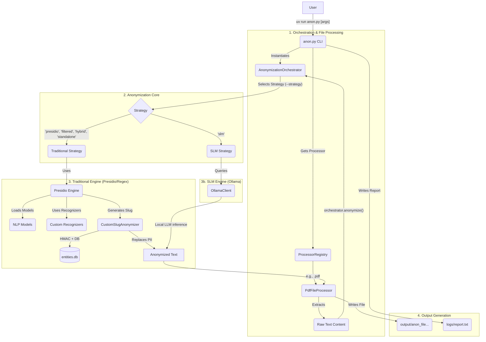

# Architecture Reference

## System Architecture

The tool is designed with a modular, layered architecture to separate responsibilities and allow for extensibility.



---

## Technology Stack

- **[Presidio](https://microsoft.github.io/presidio/):** Core engine for PII identification and anonymization.
- **[spaCy](https://spacy.io/) & [Hugging Face Transformers](https://huggingface.co/docs/transformers/index):** NLP and Named Entity Recognition (NER).
- **[Pandas](https://pandas.pydata.org/):** Structured data processing (CSV, XLSX).
- **[PyMuPDF](https://pymupdf.readthedocs.io/en/latest/) & [python-docx](https://python-docx.readthedocs.io/en/latest/):** PDF and DOCX parsing.
- **[Pytesseract](https://github.com/madmaze/pytesseract):** OCR for text extraction from images.
- **[ijson](https://github.com/ICRAR/ijson):** Streaming large JSON files.
- **[orjson](https://github.com/ijl/orjson):** JSON serialization/deserialization.
- **[openpyxl](https://openpyxl.readthedocs.io/):** Excel file processing.
- **[lxml](https://lxml.de/):** XML parsing and processing.

---

## Anonymization Mechanism

For each detected entity:

1. Normalize entity text (remove extra spaces).
2. Generate an **HMAC-SHA256** hash using `ANON_SECRET_KEY`.
3. Store the full hash (64 characters) as a unique identifier in the database.
4. Replace the entity in text with a slug of configurable length (e.g., `[PERSON_a1b2c3d4]`).

The same entity always produces the same slug, maintaining referential consistency across the anonymized output.

---

## Database Schema

SQLite database at `db/entities.db`:

| Column | Type | Description |
|:-------|:-----|:------------|
| `id` | INTEGER | Primary key |
| `entity_type` | TEXT | Entity type (e.g., `PERSON`, `LOCATION`) |
| `original_name` | TEXT | Original entity text |
| `slug_name` | TEXT | Short hash displayed in anonymized output |
| `full_hash` | TEXT | Full HMAC-SHA256 hash (UNIQUE) |
| `first_seen` | TEXT | Timestamp of first detection |
| `last_seen` | TEXT | Timestamp of last detection |

---

## Core Components

### 1. CLI Layer (`anon.py`)

The composition root: parses arguments, instantiates and wires all core components (`CacheManager`, `HashGenerator`, `EntityDetector`, `DatabaseContext`), injects dependencies into `AnonymizationOrchestrator`, dispatches files to processors, and generates performance reports.

### 2. Anonymization Orchestrator (`engine.py`)

Central coordinator. Responsibilities:
- Initializes Presidio `AnalyzerEngine` and `AnonymizerEngine`.
- Selects and injects dependencies into the chosen strategy.
- Manages the batch fallback mechanism.
- Collects entity statistics for reporting.

### 3. OCR Abstraction Layer (`src/anon/ocr/`)

All OCR operations go through a factory and a shared ABC, making it trivial to add new engines without touching processor code. Tesseract is the registered engine:

```
src/anon/ocr/
├── __init__.py             # exports get_ocr_engine()
├── base.py                 # OCREngine ABC (extract_text, is_available, name)
├── factory.py              # _REGISTRY dict + get_ocr_engine(name)
└── tesseract_engine.py     # pytesseract wrapper (default, CPU-only)
```

`FileProcessor._do_ocr(image_bytes)` dispatches to the injected engine (falls back to Tesseract if none is set). All OCR call sites in the image, DOCX, and PDF processors use this single method.

### 4. Model Registry (`src/anon/model_registry.py`)

A single `MODEL_REGISTRY` dict maps model IDs to their NER entity label mappings. Adding a new model requires only one `register_model()` call; no conditionals in `engine.py` or `strategies.py`.

```python
# Before (hardcoded):
if "SecureModernBERT-NER" in model:
    entity_mapping = SECURE_MODERNBERT_ENTITY_MAPPING
else:
    entity_mapping = ENTITY_MAPPING

# After (registry):
from .model_registry import get_entity_mapping
entity_mapping = get_entity_mapping(model_id)
```

Custom models can be registered at runtime from the YAML config file (`custom_models:` key).

### 5. File Processors (`processors.py`)

Template Method Pattern with a base `FileProcessor` and specialized subclasses:

| Processor | Handles |
|:----------|:--------|
| `TextFileProcessor` | `.txt`, `.log`: line-by-line |
| `ImageFileProcessor` | Images: OCR extraction |
| `DocxFileProcessor` | `.docx`: paragraphs + embedded images |
| `PdfFileProcessor` | `.pdf`: text blocks + images |
| `CsvFileProcessor` | `.csv`: column-wise with translation maps |
| `XlsxFileProcessor` | `.xlsx`: in-memory workbook processing |
| `XmlFileProcessor` | `.xml`: structure-preserving with XPath tracking |
| `JsonFileProcessor` | `.json`, `.jsonl`: hybrid streaming/in-memory |

**JSON Processing Modes:**
1. JSONL: line-by-line streaming
2. Small JSON (<100 MB): in-memory
3. Large JSON arrays: `ijson` streaming
4. Fallback to in-memory if streaming fails

### 4. Database Layer

**Repository Pattern (`repository.py`):** `EntityRepository` handles connection management (thread-local storage), schema initialization, batch insertion with `INSERT OR IGNORE`, and entity lookup by slug.

**Thread-Safe Queue (`database.py`):** All writes go through a `queue.Queue` consumed by a dedicated background writer thread, preventing DB write locks from blocking processing. Graceful shutdown ensures the queue is fully drained before exit.

---

## Processing Pipeline

### Anonymization Pipeline

1. **Should Anonymize Check:** Config-based exclusion → forced anonymization → text filters (stoplist, min length, numeric) → explicit/implicit mode.
2. **Entity Detection:** spaCy NER + Transformer (XLM-RoBERTa) + custom regex recognizers → merge and deduplicate.
3. **Hash Generation:** Normalize → HMAC-SHA256 with secret key → create slug.
4. **Database Storage:** Queue entity for async write.
5. **Text Replacement:** Replace entity with `[TYPE_hash]`.

### Structure Preservation

**JSON/XML:** Parse tree → collect strings by path → create translation map → reconstruct tree.

**CSV/XLSX:** Process unique values per column → create translation map → apply vectorized transformations → preserve headers.

---

## Memory Management

- **PDF:** Page-by-page with explicit cleanup (`page.clean_contents()`, `del page`).
- **JSON:** `ijson` streaming for large arrays; line-by-line for JSONL.
- **CSV/XLSX:** Chunked Pandas reads; XLSX iterates cells without loading full workbook.
- **GC Control:** `--disable-gc` disables automatic GC for large single files; explicit `gc.collect()` calls are placed strategically.

---

## Caching Strategy

LRU cache (`collections.OrderedDict`):
- Configurable size via `--max-cache-size` (default: 10,000 items).
- Enabled by default; disable with `--no-use-cache`.
- Caches `(original_text → anonymized_slug)` pairs to avoid redundant detection and hashing.

---

## Fallback Architecture

After batch processing, the orchestrator verifies input count == output count. On mismatch:
1. `_safe_fallback_processing` re-processes items one-by-one.
2. Errors are logged; problematic items return original text to preserve structure.
3. Prevents misaligned output in structured files (CSV, JSON, XML) and accidental PII exposure.

---

## Repository Structure

```
.
├── anon.py                          # CLI entry point
├── pyproject.toml                   # Project metadata and dependencies
├── uv.lock                          # Dependency lock file
├── benchmark/benchmark.py           # Performance benchmarking script
├── .gitignore                       # Ignored files and directories
│
├── examples/
│   ├── anonymization_config.json    # Default anonymization config
│   ├── anonymization_config_cve.json # CVE-specific config example
│   ├── word_list.example.json       # Word list format example
│   └── exemplo.docx / exemplo.xlsx  # Sample documents
│
├── docker/
│   ├── Dockerfile                   # Multi-stage build (CPU + GPU)
│   ├── docker-compose.yml           # Service profiles
│   └── docker-entrypoint.sh        # Container entrypoint
│
├── examples/
│   ├── anon_config.example.yaml     # Full config file template (all options)
│   ├── profiles/
│   │   └── banking_pt.yaml          # Pre-configured Brazilian banking profile
│   └── patterns/
│       └── banking_pt.yaml          # Custom patterns: CPF, CNPJ, PIX, CEP, RG
│
├── src/anon/                        # Core library
│   ├── config.py                    # Entity mappings, language lists
│   ├── engine.py                    # AnonymizationOrchestrator
│   ├── strategies.py                # FullPresidio, Filtered, Hybrid strategies
│   ├── standalone_strategy.py       # StandaloneStrategy + RegexOnlyStrategy
│   ├── model_registry.py            # Transformer model registry
│   ├── entity_detector.py           # NER entity detection + regex-only extraction
│   ├── processors.py                # File processors (OCR engine injection)
│   ├── repository.py                # EntityRepository (SQLite)
│   ├── database.py                  # Thread-safe DB writer queue
│   ├── hash_generator.py            # HMAC-SHA256 hash generation
│   ├── cache_manager.py             # LRU cache
│   ├── security.py                  # Key validation
│   ├── tqdm_handler.py              # Progress bar handler
│   ├── core/
│   │   ├── config_loader.py         # Configuration loading
│   │   ├── run_config.py            # YAML run config loader + CLI merger
│   │   └── protocols.py             # Protocol interfaces
│   ├── ocr/                         # OCR abstraction layer (Tesseract)
│   │   ├── __init__.py
│   │   ├── base.py                  # OCREngine ABC
│   │   ├── factory.py               # get_ocr_engine(name) factory
│   │   └── tesseract_engine.py      # Tesseract (default)
│   ├── slm/                         # Small Language Model integration
│   │   ├── client.py                # OllamaClient (SLMClient protocol)
│   │   ├── prompts.py               # PromptManager
│   │   ├── prompts/                 # Prompt templates ({task}/{version}_{lang}.json)
│   │   ├── ollama_manager.py        # Ollama process management
│   ├── evaluation/                  # Evaluation support (Internal)
│   │   ├── ground_truth.py          # Ground truth loading
│   │   ├── hash_tracker.py          # Hash tracking for evaluation
│   │   └── metrics_calculator.py    # TP/FP/FN metrics
│
├── scripts/                         # Utility scripts
│   ├── deanonymize.py               # Controlled de-anonymization
│   ├── export_and_clear_db.py       # DB export/clear
│   ├── slm_regex_generator.py       # Entity map analysis
│   └── utils.py                     # Shared utilities
│
├── tests/                           # Unit and integration tests
└── docs/                            # Documentation
    └── developers/
        ├── ARCHITECTURE.md
        ├── ANONYMIZATION_STRATEGIES.md
        ├── EXTENSIBILITY.md
        ├── SLM_INTEGRATION_GUIDE.md
        └── UTILITY_SCRIPTS_GUIDE.md
```

---

### See Also

- [Extensibility Guide](EXTENSIBILITY.md): all extension points with worked examples (strategies, processors, cache, storage, SLM client, model providers, etc.)
- [Anonymization Strategies](ANONYMIZATION_STRATEGIES.md): detailed description of each built-in strategy
- [SLM Integration Guide](SLM_INTEGRATION_GUIDE.md): deep dive into the SLM module architecture
- [Contributing](../../.github/CONTRIBUTING.md): development setup, conventions, and pull-request process
- [Changelog](../../.github/CHANGELOG.md): release history
